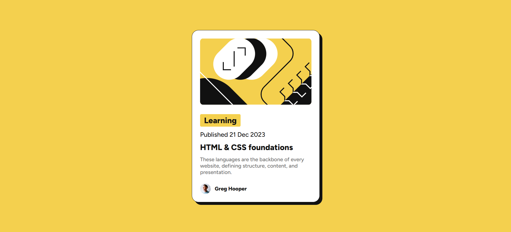

# Frontend Mentor - Blog preview card solution

This is a solution to the [Blog preview card challenge on Frontend Mentor](https://www.frontendmentor.io/challenges/blog-preview-card-ckPaj01H).

## 📸 Screenshot

## 🔗 Live Site

[View Live Site](https://mohamed-ahmed-137.github.io/blog-preview-card/)

## 🚀 Built With

- Semantic HTML5
- CSS Flexbox
- `clamp()` for responsive typography
- Local fonts with `@font-face`
- Mobile-first approach

## 🧠 What I Learned

- How to structure semantic HTML using `<main>` and `<article>`
- Applying `@font-face` for local `.ttf` fonts
- Making responsive typography using `clamp()`
- Creating a responsive card layout without media queries

## 📁 Folder Structure

blog-preview-card/
│
├── assets/
│ ├── fonts/
│ └── images/
├── index.html
├── style.css
└── README.md

## ✍️ Author

- Frontend Mentor – [Mohamed-Ahmed-137](https://www.frontendmentor.io/profile/Mohamed-Ahmed-137)
- GitHub – [Mohamed-Ahmed-137](https://github.com/Mohamed-Ahmed-137)

---

Feel free to give any feedback!
